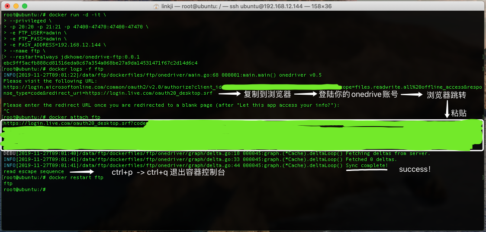

# "超级" ftp服务搭建

## 话不多说, 先放成果

- 启动一个docker容器即可获得开箱即用的ftp服务，这个ftp服务**自带5TB的存储空间**。
- 容器是**无状态**的，你上传到这个ftp中的内容不会因为你删除了容器而丢失。

## 原理

> 写在前面: **5T 的空间是由微软的OneDrive提供的，你需要注册并购买.**

最近发现一个开源项目: [jstaf/onedriver](https://github.com/jstaf/onedriver)   
jstaf/onedriver 实现了一个网络文件系统 并能够将 OneDrive 挂载至本地目录

jstaf的想法非常棒！这正是我想要的 我在这位大佬的基础上加上了 docker 和 vsftpd

于是我最终实现了 [onedrive-ftp](https://github.com/jdkhome/onedrive-ftp) 

当然，你也可以直接使用jstaf/onedriver ,封装成ftp服务只是因为我个人有一些其他需求 :)


## 部署

#### 启动容器

```sh
docker run -d -it \
--privileged \
-p 20:20 -p 21:21 -p 47400-47470:47400-47470 \
-e FTP_USER=admin \
-e FTP_PASS=admin \
-e PASV_ADDRESS=192.168.12.144 \
--name ftp \
--restart=always jdkhome/onedrive-ftp:0.0.1
```

#### 查看日志

```sh
docker logs -f ftp
```

根据日志提示，复制 **Please visit the following URL:** 下方的链接 至你的浏览器

在网页中登陆你的onedrive账号 然后页面会自动跳转, 复制跳转到的链接

#### 进入到容器控制台

```sh
docker attach ftp
```

粘贴前面复制的链接然后 回车

当控制台打印：**Sync complete!** 即代表onedrive授权成功了。

退出容器控制台
Ctrl+p Ctrl+q

#### 重启容器

```sh
docker restart ftp
```

大概15s 后ftp服务会启动。

#### 附图



至此部署已完成。
以后无论怎么重启容器都不需要再做上面的操作了。

