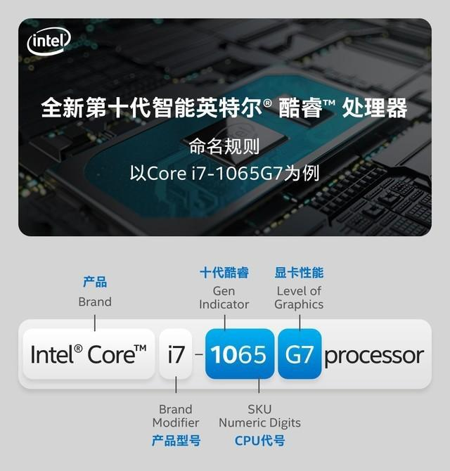

# 攒机指南

> 本文介绍在当前的市场环境下，如何通过自己攒机来组装出高性价比的电脑主机。

## 为什么要自己攒机

#### 自己更了解自己的需求

通常来说，不同的需求，对应的配置是不同的。  
你是普通办公，是做设计还是做开发，是做科学计算还是做视频渲染；  
这些需求对应的硬件依赖程度是不一样的，“水桶机”固然方便，但是这也带来了很大程度上的资源闲置。  
根据自己的需求，把预算用在“刀刃”上，且不是更香？

#### 再也不会被“奸商”坑钱

没有中间商赚差价，更不会因为不懂而被忽悠。

#### 为了以后能够持续升级

了解自己机器短版，也了解机器的升级空间。

## 电脑主机的几大组成

#### CPU

CPU负责执行命令  
软件在运行时需要进行各种的计算、逻辑处理，这些工作就是CPU去执行的。

#### 主板

主板可以理解为支撑这些硬件运行的平台 并为你控制这些硬件提供一系列接口和扩展(比如USB之类的)

#### 显卡

显卡负责控制电脑的图像输出 很多针对图像输出的计算也是在显卡中完成的，由于显卡GPU的浮点运算能力比CPU更好，一些科学计算的场景也会使用显卡。

#### 内存

内存负责存储“使用中”的内容 比如打开的软件，这个软件对应的机器代码就存在内存中。

#### 硬盘

硬盘负责存储“持久化”的内容 比如: 下载的各种图片、照片、电影，安装的软件、操作系统 这些都是存在硬盘里的。

#### 电源

电源 变压器+稳压器

#### 机箱

机箱 好看、保护硬件


https://zhidao.baidu.com/question/279855650.html

## CPU科普

首先是明白 目前主流的生产CPU的两家公司

Intel 和 AMD

下面是攒机玩家们对这两个品牌的主流看法:

1. 价格：同主频的AMD处理器与Intel处理器，前者价格只是后者的一半左右；
2. 稳定性：Intel处理器的稳定性比AMD处理器的稳定性更好；
3. 发热量：AMD处理器的发热量比Intel处理器的发热量大。
4. 性能：Intel单核性能吊打AMD 即使主频相同。

家用领域:
Intel 酷睿系列 买8代及以上的 
AMD  Ryzen系列 

### Intel 酷睿系列 命名规则

#### 10代以前

```
Intel® Core™ i7-8600K
```

name | value | desc
-|-|-
商标 | Intel® | - |
品牌 | Core™ | - |
型号 | i7 | i3(入门)、i5(主流)、i7(高端)、i9 |
代际 | 8 | 数字越大 架构越新 |
代号 | 600 | SKU数值 一般是越大性能越强(也有例外比如纪念版8086) |
后缀 | K | K代表可超频 |

Core 系列型号后缀

后缀 | 说明
-|-
X | 消费级最高CPU |
K | 不锁频，也就是可以超频 |
R | 内置当代最高性能核显 |
C | CPU性能缩水，核显性能增强 |
F | 代表没有核显的CPU, 需要搭配独立显卡使用 |
S/T | 节能版, 功耗和频率相对降低 |
L/U | 分别是低压版和超低压版 |
Y | 超低功耗版 |
H | 焊在主板上的CPU(也就是BGA封装) 一般在笔记本电脑上 | 
M | 标准电压CPU，功耗30W以上，每一代CPU功耗不同，一般用于1~4代 |
Q | 一般为4核CPU |

- [CPU后缀](https://zhuanlan.zhihu.com/p/67663261)

复合后缀的话就是2个含义加起来

#### 10代以后

引用官方的一张图




### Intel 志强系列 命名规则

#### 以前的规则

```
Intel® Xeno® E5-2687W v3
```

name | value | desc
-|-|-
商标 | Intel® | - |
品牌 | Xeno® | - |
型号 | E5 | E3、E5、E7 和酷睿一样代表档次 |
路数 | 2 | 1、2、4、8 代表CPU最大并行路数, 也就是一块主板上能插多少这个型号的CPU, 比如 E5-2687W v3 就是双路CPU |
代号 | 687 | SKU 一般是越大性能越强 |
后缀 | W | W代表高功耗版 性能也会好一些 |
版本 | v1 v2 v3 v4 ... 当然是越大越新(注意不同版本的CPU对主板的芯片组要求也不同) |

Xeno 系列型号后缀

后缀 | 说明
-|-
L | 低功耗版 |
W | 高功耗版 |
M | 移动平台特化版 |

#### 新规则

也许

```
Intel® Xeno® Platinum 8XXX Processor 
Intel® Xeno® Gold 6XXX Processor
Intel® Xeno® Gold 5XXX Processor
Intel® Xeno® Silver 8XXX Processor
Intel® Xeno® Bronze 8XXX Processor
```

第一位数字：8(铂金),6/5(金牌)、4(银牌)、3(铜牌)
第二位数字：代表第N代
第三四位数字：SKU(库存单位)编号

新后缀说明

后缀 | 说明
-|-
F | Fabric；集成Intel OmniPath Fabric |
T | 高 Tcase/扩展可靠性 |
M | 每 CPU 插槽支持 1.5TB 内存容量，无则为 768GB |
P | 采用 FPGA 封装 |

**E5 单路，为工作站用途，命名为 Xeon W** 比如最新的Mac Pro 的处理器就是  
**E3 命名为 XEON E 代表Entry，入门级工作站处理器**    
**原 Xeon D 保持不变**

- [Intel Xeon 处理器 新命名规则](https://www.frost.net.cn/wordpress/archives/1385) 寒霜

### AMD CPU命名规则

// todo

### 买CPU需要看的属性

并不是说i7 就 一定比i3好，先看代际或者是版本 越新的CPU制程就越小，对应着相同的性能功耗更低 

属性 | 说明
-|-
主频| 代表了CPU的计算速度,数字越大越快; 相关还有 睿频: 代表CPU能够自动加速达到的最大临时频率 超频: 人为加压提高CPU的运行频率 |
核心数| 一个CPU可以有多个内核，这些内核可以同时处理不同的任务 |
线程数| 一般是通过超线程技术 把一个内核虚拟成2个线程 进一步提高并行计算的能力 |
功耗| 越大越费电，发热量也越高 | 
接口| 与主板的CPU插槽对应 值得一提Intel发布的CPU经常换接口，导致升级CPU连带着主板也得换 |

### 天梯图

## 显卡

按照形式而言 显卡分三种:

1. 核芯显卡: 简称核显 这是在CPU芯片中集成的显卡芯片，intel core系列不带"F"的CPU ,以及AMD 的 A6 A8 A10系列、Ryzen 带“g” 的CPU 这些CPU都有带核显。 AMD本身也有很强大的显卡开发经验，所以AMD的核显普遍强于 Intel的核显。
2. 集成显卡: 简称集显 这是在主板上集成的显卡 性能比核显还烂，不过也有例外，比如板载双路GTX680的华硕宙斯x79。
3. 独立显卡: 简称独显 拥有独立的显存 独立的供电 以及强劲的性能 3d渲染、玩游戏、科学计算 都离不开独显强大的性能。

那么显卡也有两大阵营 NVIDIA 和 AMD (简称 N卡和A卡) , 一般来说 N卡兼容性更好，很多软件和游戏都对N卡有更多的优化，使其游戏体验更出色，A卡同等价格则是配置更高，跑分更出色，所以早期很多挖矿都是使用A卡。

N卡的前缀有GTX、GTS、GT、GF，它们代表显卡的档次，其中GTX为高端 ，GTS为简化版， GT是低端， GF为入门级，前缀后面紧跟的数字代表的是显卡的代数和等级。
以现在市面上较为主流的GTX1060为例，前缀GTX说明它被列为高端行列，10代表是第十代，60代表在此行列中属于中等性能，最后的两位数值越大性能越好。
N卡还有后缀一般为Ti和M，Ti代表加强版，M为移动版，用在笔记本上，为控制功耗所以性能会差一些。


## 预备知识