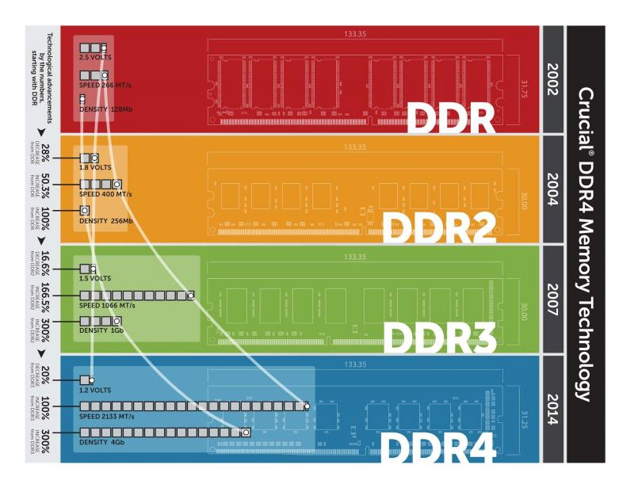

# 内存

计算机中所有程序的运行都是在内存中进行的，其作用是用于暂时存放CPU中的运算数据，以及与硬盘等设备交换的数据。只要计算机在运行中，CPU就会把需要运算的数据调到内存中进行运算，当运算完成后CPU再将结果传送出来，因此内存的性能对计算机的影响非常大。

对于内存来说 有两个明显的指标:

## 内存有关的参数

### 类型

目前新平台都是使用 DDR4内存 ，老一点的平台使用DDR3 再老一点的DDR2 和DDR已经淘汰掉了。

图片也反应了 内存越新速度越快。

当然能否使用新一代的内存 还与主板的插槽有着直接关系。

### 容量

内存越大 能够同时运行的程序就越多。

### 频率

频率越大 读写速度和数据传输速度就越快。  
如果一台电脑上装了多个内存条，那么内存的频率会同步为频率最低的那个。所以如果计划插入多根内存则应尽量购买同频率同型号同规格，甚至同一批次的内存  
另外内存和和CPU一样也是可以超频的。

## 通道

多根内存协同工作时，数据传输可能走不同的通道 也可能共用一个通道，这取决于 CPU和主板的支持 以及内存的插法。

多通道技术可以类比成磁盘阵列的RAID0，使用了多通道对于内存速度是成倍提升的，在使用核显或集显时，由于是共享显存 所以更要注意。

一般支持多通道的主板都会在插座处标识通道规则。

