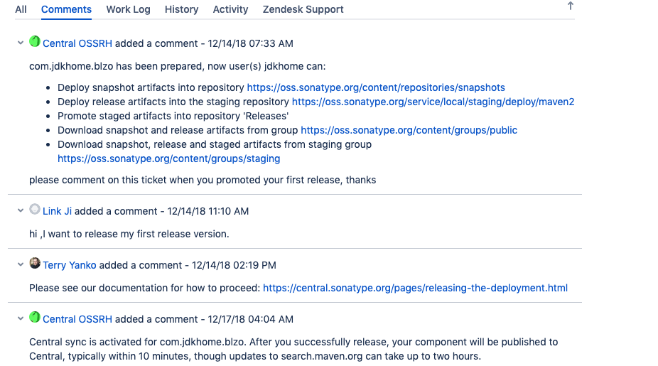

# 发布jar包到maven中央仓库

## sonatype准备工作

中央仓库是由sonatype管理的，你需要先进行一系列操作才能发布。

1. 在[Sonatype](https://issues.sonatype.org)注册账户
2. 创建issues，类型为新项目
3. 按照工作人员的要求证明group_id域名的所有权，如果你没域名的话，也可以使用xxx.github.io 这样的二级域名
4. 证明完成之后就可以开始下一步了

### 创建项目


### 沟通过程

> 由于我的注册邮箱是我域名下的邮箱，可能是这个原因，所以证明域名所有权的过程省掉了



## gpg签名

接下来你还需要创建gpg签名文件来证明发布者的身份

[GPG入门教程](http://www.ruanyifeng.com/blog/2013/07/gpg.html)阮一峰

### 大致流程

```sh
# 生成一个密钥
gpg --gen-key

# 列出密钥
gpg --list-keys

# 发布公钥
gpg --send-keys [用户ID] --keyserver hkp://subkeys.pgp.net

```

### gradle配置


vim ~/.gradle/gradle.properties 
```ini
NEXUS_USERNAME= xxxx
NEXUS_PASSWORD= xxxx

signing.keyId= gpg的秘钥指纹后八位 
signing.password= gpg密钥对的设置的密码
signing.secretKeyRingFile= /Users/linkji/.gnupg/secring.gpg
```

注意: **signing.secretKeyRingFile** 这个配置对应的.gpg文件，你要在 ~/.gnupg/ 目录下寻找，如果没有，则需参考下面的链接

[Signing plugin doesn't work with GPG 2.1](https://github.com/gradle/gradle/issues/888)bryant1410


## 项目配置

### build.gradle

这里列出主要配置，完整配置请参考[blzo-ex](https://github.com/jdkhome/blzo-ex/blob/master/build.gradle)

```groovy
apply plugin: 'maven-publish'  // maven 发布插件
apply plugin: 'signing'  // 签名插件


version '0.3.1.RELEASE'
group 'com.jdkhome.blzo'

sourceCompatibility = 1.8
compileJava {
    sourceCompatibility = 1.8
    targetCompatibility = 1.8
    [compileJava]*.options*.encoding = 'UTF-8'
}
compileTestJava {
    sourceCompatibility = 1.8
    targetCompatibility = 1.8
    [compileTestJava]*.options*.encoding = 'UTF-8'
}

//这里一定得要。在多模块下，不然编译失败，因为不会把信赖模块给打包。
jar {
    enabled = true
}

// 后面的都是打包的配置
task sourcesJar(type: Jar) {
    classifier = 'sources'
    from sourceSets.main.allJava
}
// 生成 javadoc jar
    task javadocJar(type: Jar) {
    classifier = 'javadoc'
    from javadoc.destinationDir
}
// javadoc 配置，这里是自定义了 java doc 的一些配置
javadoc {
    description = project.name

    options.memberLevel = org.gradle.external.javadoc.JavadocMemberLevel.PROTECTED
    options.author = true
    options.version = true
    options.header = project.name
    options.addStringOption('Xdoclint:none', '-quiet')

    // suppress warnings due to cross-module @see and @link references;
    // note that global 'api' task does display all warnings.
    logging.captureStandardError LogLevel.INFO
    logging.captureStandardOutput LogLevel.INFO // suppress "## warnings" message
    options.encoding = "UTF-8"  //编码一定要配置否则直接出错
    options.charSet = 'UTF-8'
}

publishing {
    publications {
        mavenJava(MavenPublication) {
            groupId project.group
            artifactId project.name
            version "${version}"
            from components.java
            artifact sourcesJar
            artifact javadocJar

            // https://docs.gradle.org/current/dsl/org.gradle.api.publish.maven.MavenPublication.html
            pom {
                name = project.name
                description = project.name
                url = "https://github.com/jdkhome/blzo-ex/tree/master/" + project.name
                licenses {
                    license {
                        name = "The Apache License, Version 2.0"
                        url = "http://www.apache.org/licenses/LICENSE-2.0.txt"
                    }
                }
                developers {
                    developer {
                        id = "jdkhome"
                        name = "linkji"
                        email = "main@jdkhome.com"
                    }
                }
                scm {
                    connection = "scm:git:https://github.com/jdkhome/blzo-ex.git"
                    developerConnection = "scm:git:https://github.com/jdkhome/blzo-ex.git"
                    url = "https://github.com/jdkhome/blzo-ex"
                }
            }
        }
    }
    repositories {
        maven {
            name 'sonatypeRepository'
            url 'https://oss.sonatype.org/service/local/staging/deploy/maven2/'
            credentials {
                username = "${NEXUS_USERNAME}"
                password = "${NEXUS_PASSWORD}"
            }
        }
        maven {
            name = 'sonatypeSnapshotRepository'
            url = 'https://oss.sonatype.org/content/repositories/snapshots/'
            credentials {
                username = "${NEXUS_USERNAME}"
                password = "${NEXUS_PASSWORD}"
            }
        }
    }
}

// 必须在 publishing 配置之后
signing {
    sign publishing.publications.mavenJava
}

```

## 发布

对于发布来说，有2个地址，对应前面**build.gradle**中，我们配置的2个可以发布的仓库

```groovy
repositories {
    maven {
        name 'sonatypeRepository'
        url 'https://oss.sonatype.org/service/local/staging/deploy/maven2/'
        credentials {
            username = "${NEXUS_USERNAME}"
            password = "${NEXUS_PASSWORD}"
        }
    }
    maven {
        name = 'sonatypeSnapshotRepository'
        url = 'https://oss.sonatype.org/content/repositories/snapshots/'
        credentials {
            username = "${NEXUS_USERNAME}"
            password = "${NEXUS_PASSWORD}"
        }
    }
}
```

- release:
    - 表示正式版，稳定版本
    - 需要 gpg 签名才可以发布成功
- snapshot:
    - 快照版， 不稳定的，开发的时候常用
    - 必须携带 -SNAPSHOT 后缀

发布命令为

```sh
# 发快照
gradle publishMavenJavaPublicationToSonatypeSnapshotRepository

# 发release
gradle publishMavenJavaPublicationToSonatypeRepository
```

