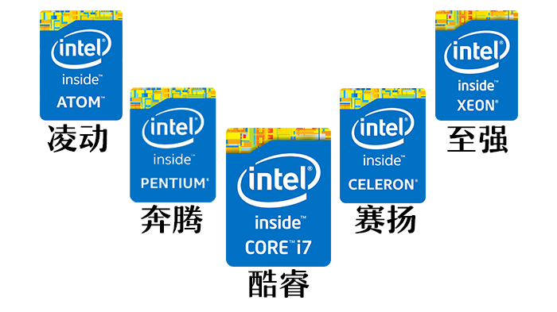
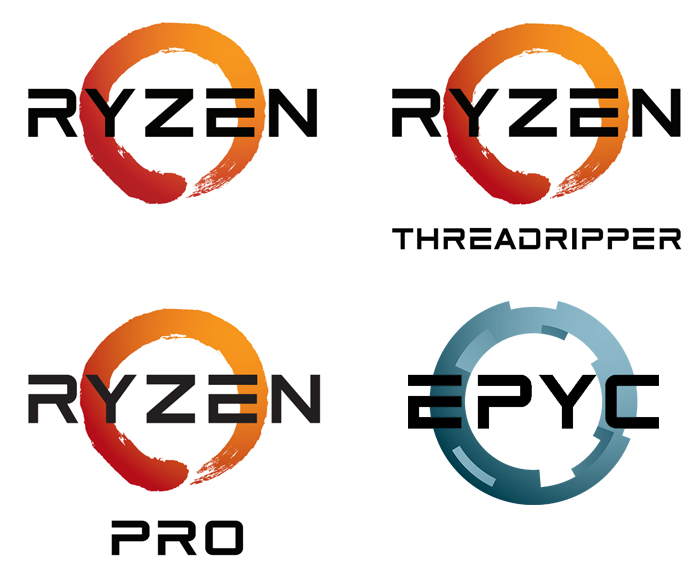

# CPU

软件在运行时需要进行各种的计算、逻辑处理，这些工作就是CPU去执行的。

那么在购买CPU之前，首先要知道 目前主流的生产CPU的两家公司

**Intel** 和 **AMD**

攒机玩家们对这两个品牌的主流看法如下:

1. 价格：同主频的AMD处理器与Intel处理器，前者价格只是后者的一半左右；
2. 稳定性：Intel处理器的稳定性比AMD处理器的稳定性更好；
3. 发热量：AMD处理器的发热量比Intel处理器的发热量大。
4. 性能：Intel单核性能吊打AMD 即使主频相同。

家用领域:
Intel 酷睿系列 买8代及以上的 
AMD  Ryzen系列 

## CPU的命名规则


Intel 的产品线划分为：Core（酷睿）、Pentium（奔腾）、Celeron（赛扬）、Xeon（至强）、Atom（凌动）等。
除了Xeon是专门针对服务器领域以外，其他系列均有对应的消费级市场产品，桌面、移动平台、笔记本上都有。



AMD 在推出Zen架构后,产品线划分为：Ryzen（锐龙）、Ryzen Pro（锐龙Pro）、Ryzen Threadripper（锐龙线程撕裂者）、EPYC（霄龙），除了EPYC霄龙隶属于服务器CPU外，Ryzen锐龙系列都是有消费级桌面、移动产品。  
老一代的还有皓龙



> 这里就主要针对 家用主流的 酷睿系列、锐龙系列 服务器主流的 志强系列、霄龙系列 聊聊命名规则。  
一般来说 我们光看CPU的名字就可以知道这个CPU的大致属性。

### Intel® Core™(酷睿) 10代以前

```
Intel® Core™ i7-8600K
```

name | value | desc
-|-|-
商标 | Intel® | 因特尔 |
品牌 | Core™ | 酷睿系列 |
型号 | i7 | i3(入门)、i5(主流)、i7(高端)、i9 |
代际 | 8 | 数字越大 架构越新 |
代号 | 600 | SKU数值 一般是越大性能越强(也有例外比如纪念版8086) |
后缀 | K | K代表可超频 |

Core 系列型号后缀

后缀 | 说明
-|-
X | 消费级最高CPU |
K | 不锁频，也就是可以超频 |
R | 内置当代最高性能核显 |
C | CPU性能缩水，核显性能增强 |
F | 代表没有核显的CPU, 需要搭配独立显卡使用 |
S/T | 节能版, 功耗和频率相对降低 |
L/U | 分别是低压版和超低压版 |
Y | 超低功耗版 |
H | 焊在主板上的CPU(也就是BGA封装) 一般在笔记本电脑上 | 
M | 标准电压CPU，功耗30W以上，每一代CPU功耗不同，一般用于1~4代 |
Q | 一般为4核CPU |
G | 爱情结晶版♂ CPU部分由Intel提供，GPU由AMD提供 |

- [CPU后缀](https://zhuanlan.zhihu.com/p/67663261)

复合后缀的话就是2个含义加起来

### Intel® Core™(酷睿) 10代以后

千言万语也不如官方的这张图


### Intel® Xeno®(志强) Old

```
Intel® Xeno® E5-2687W v3
```

name | value | desc
-|-|-
商标 | Intel® | 英特尔 |
品牌 | Xeno® | 志强系列 |
型号 | E5 | E3、E5、E7 和酷睿一样代表档次 |
路数 | 2 | 1、2、4、8 代表CPU最大并行路数, 也就是一块主板上能插多少这个型号的CPU, 比如 E5-2687W v3 就是双路CPU |
代号 | 687 | SKU 一般是越大性能越强 |
后缀 | W | W代表高功耗版 性能也会好一些 |
版本 | v1 v2 v3 v4 ... 当然是越大越新(注意不同版本的CPU对主板的芯片组要求也不同) |

Xeno 系列型号后缀

后缀 | 说明
-|-
L | 低功耗版 |
W | 高功耗版 |
M | 移动平台特化版 |

### Intel® Xeno®(志强) New

```
Intel® Xeno® Platinum 8XXX Processor 
Intel® Xeno® Gold 6XXX Processor
Intel® Xeno® Gold 5XXX Processor
Intel® Xeno® Silver 8XXX Processor
Intel® Xeno® Bronze 8XXX Processor
```

第一位数字：8(铂金),6/5(金牌)、4(银牌)、3(铜牌)
第二位数字：代表第N代
第三四位数字：SKU(库存单位)编号

新后缀说明

后缀 | 说明
-|-
F | Fabric；集成Intel OmniPath Fabric |
T | 高 Tcase/扩展可靠性 |
M | 每 CPU 插槽支持 1.5TB 内存容量，无则为 768GB |
P | 采用 FPGA 封装 |

**E5 单路，为工作站用途，命名为 Xeon W** 比如最新的Mac Pro 的处理器就是  
**E3 命名为 XEON E 代表Entry，入门级工作站处理器**    
**原 Xeon D 保持不变**

- [Intel Xeon 处理器 新命名规则](https://www.frost.net.cn/wordpress/archives/1385) 寒霜

### AMD Ryzen(锐龙) 系列

Ryzen，也就是锐龙系列。现在去买AMD的家用CPU，Ryzen系列几乎是不二只选。Zen架构的发售可以说是AMD的翻身一弈，AMD也许是为了和Intel Core系列正面刚，所以锐龙系列的命名也和酷睿系列十分相似，明显就是引导玩家们进行同级对比。

```
AMD Ryzen 5 3600X
```

name | value | desc
-|-|-
商标 | AMD | AMD |
品牌 | Ryzen | 锐龙系列 |
型号 | 5 | 3、5、7、9 |
代际 | 3 | 数字越大 1=第一代(Zen架构) 2=第二代(Zen+架构) 3=第三代(Zen2架构)  |
代号 | 600 | SKU数值 越大性能越强 |
后缀 | X | 支持XFR技术 |

后缀 | 说明
-|-
X | 支持XFR技术，自适应动态扩频，除了睿频以外，还能够让CPU做工在高于睿频频率的工作状态，而频率的最大值受到散热器散热效果而变化，简单来说就是，散热器越强，频率越高 |
G | 只有带G的系列才会带有集显 |
U | 专门面向轻薄笔记本产品，超低功耗，并且集成核显 |

### AMD EYPC™(霄龙) 系列

EYPC ，AMD面向服务器市场所推出的霄龙系列 (高通骁龙:???)

霄龙的命名规则好难找 // todo ...

## 买CPU需要看的属性

并不是说i7 就 一定比i3好，先看代际或者是版本 越新的CPU制程就越小，对应着相同的性能功耗更低 

属性 | 说明
-|-
主频| 代表了CPU的计算速度,数字越大越快; 相关还有 睿频: 代表CPU能够自动加速达到的最大临时频率 超频: 人为加压提高CPU的运行频率 |
核心数| 一个CPU可以有多个内核，这些内核可以同时处理不同的任务 |
线程数| 一般是通过超线程技术 把一个内核虚拟成2个线程 进一步提高并行计算的能力 |
功耗| 越大越费电，发热量也越高 | 
接口| 与主板的CPU插槽对应 值得一提Intel发布的CPU经常换接口，导致升级CPU连带着主板也得换 而AMD自2016年以来几乎将所有家用U的接口都统一为了AM4 |
指令集| 比如虚拟机用户需要注意VT-x 科学计算用户需要注意  |

## 性价比之选


### Intel 测试版 CPU

一般分为 ES版 和 QS版

### Intel 剪角U

### AMD 开核U

## 参考链接

- [程序员选CPU不懵逼，5分钟搞懂命名规则](https://www.cnblogs.com/asdf89/p/9579733.html) 万象更新新
- [Inte的lCPU与AMD的CPU架构简介以及名称规则](https://blog.csdn.net/qq_27825451/article/details/89225571) LoveMIss-Y
