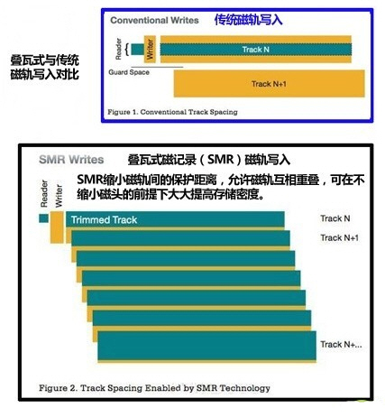
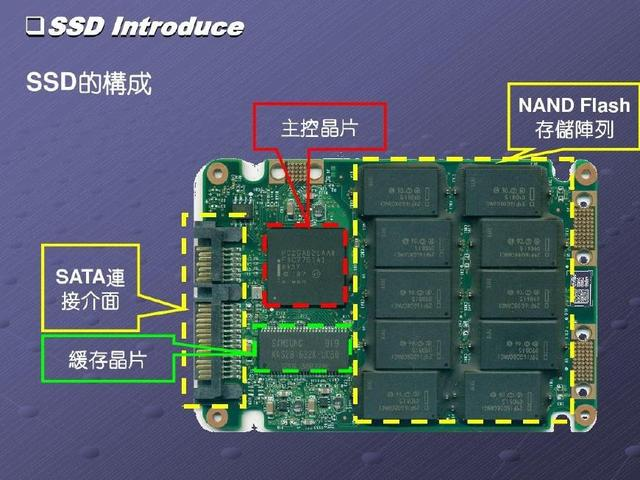
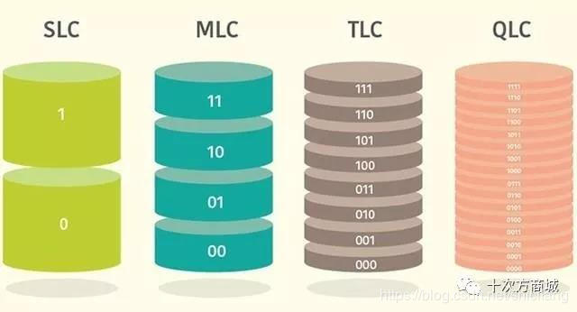
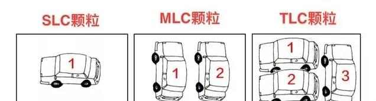

# 硬盘

## 机械硬盘

机械硬盘有着容量大便宜的特点，并且在稳定环境下工作寿命远高于固态硬盘，即使损坏，依然也能够有一些手段找回数据。  
而台式机的工作环境本身也属于比较稳定，所以推荐组台式机时选购机械硬盘用于存文件存资料。  

买机械硬盘的话，有必要关注一下机械硬盘的磁记录技术方案。传统垂直式 和 SMR叠瓦式。

### 垂直式

垂直式优势主要是擦除数据时不会影响到附近轨道的其他数据，因此安全性相对更高，同时碎片化写入数据时也不会造成硬盘负担过重而大幅掉速，而叠瓦式的随机读写性能差就会有相对明显的掉速。此外因为叠瓦式擦除+覆写数据的操作需要磁头写入两次数据，相对的磁头寿命会因此受到影响。

### 叠瓦式

叠瓦式磁记录(Shingled Magneting Recording/SMR)其实原理很简单：就是缩小了磁轨间的保护距离，特别是允许磁轨互相重叠，就像屋顶的叠瓦，这样自然就能在不缩小磁头的前提下大大提高存储密度。以现在的技术SMR可以做到单碟2TB以上的存储容量。

其缺点和NAND闪存很相似。如果是向一个空白的碟片写入数据，SMR很好很强大，但如果面对已经存有数据的一系列磁轨，SMR的写入过程其实是毁灭性的。写入针对的仍是磁轨的全部宽度，而磁轨是互相重叠的，这就意味着覆盖一个磁轨，也会影响邻近的，会被一块儿重写。

综合上述分析得知SMR叠瓦记录技术只适用于当仓库盘用，对于一次性写入的影音类，图文类是有好的表现的，前提是一次性写入后切记不要再执行修改或替换任何文件的操作，只能当成为只读盘用。

### 总结

叠瓦式优点便宜，缺点是速度慢；由于寻道和随机读写远不如垂直，所以缓存都搞得很大。而辨别叠瓦式硬盘，目前有几种方式，在购买时，消费级机械硬盘产品容量在2TB以内的，缓存如果有256MB，基本可以肯定是叠瓦式硬盘。而一个产品拿到手之后，也可以使用一些硬盘的测试软件对其进行随机读写性能测试，一般性能相对同容量产品差的比较多的话，也应该是叠瓦盘。

## 固态硬盘

固态硬盘是用固态电子存储芯片阵列而制成的硬盘，它具有传统机械硬盘不具备的快速读写、质量轻、能耗低以及体积小等特点，当然缺点也很明显，价格贵，容量低，坏了之后难以恢复数据。

通常来说，在享受固态硬盘的高速体验的同时，还是建议把重要数据放在机械硬盘 以及云盘进行备份。

### 接口

目前常见的固态硬盘有如下接口

#### SATA

外观一般兼容2.5寸的机械硬盘，通过SATA线和硬盘供电线连接主板。

#### mSATA

#### m.2

m.2是近些年流行起来的新的固态接口，流行起来的原因也是因为它的速度比传统SATA接口更快。

如果期望上m.2的固态硬盘，就需要关注主板上有没有这个接口了，此外还需要注意m.2接口的类型。  
m.2接口有2中实现，一种是走pcie通道(也就是nvme) 另一种是走sata通道。  

走sata通道的m.2接口速度与传统的sata接口没区别，其意义可以直接插在主板上无需额外走线。

如果目标就是追求更快的速度那么购买时就需注意挑选NVMe PCIe协议的m.2了

#### u.2

昙花一现。。对应的硬件产品比较少，所以这里只提一下名字。

### 存储颗粒

首先明白 固态硬盘的存储介质是闪存颗粒。由于闪存颗粒中存储密度存在差异，所以闪存又分为SLC、MLC、TLC和QLC。简单的说，NAND闪存的基本原理，QLC容量大，但性能也变差了。

name | desc 
-|-
SLC | 每个Cell单元存储1bit信息，也就是只有0、1两种电压变化，结构简单，电压控制也快速，反映出来的特点就是寿命长，性能强，P/E寿命在1万到10万次之间，但缺点就是容量低而成本高，毕竟一个Cell单元只能存储1bit信息。|
MLC | 每个cell单元存储2bit信息，需要更复杂的电压控制，有00,01,10,11四种变化，这也意味着写入性能、可靠性能降低了。其P/E寿命根据不同制程在3000-5000次不等。|
TLC | 每个cell单元存储3bit信息，电压从000到001有8种变化，容量比MLC再次增加1/3，成本更低，但是架构更复杂，P/E编程时间长，写入速度慢，P/E寿命也降至1000-3000次，部分情况会更低。寿命短只是相对而言的，通常来讲，经过重度测试的TLC颗粒正常使用5年以上是没有问题的。|
QLC | QLC或者可以叫4bit MLC，电压有16种变化，但是容量能增加33%，就是写入性能、P/E寿命与TLC相比会进一步降低。具体的性能测试上，美光有做过实验。读取速度方面，SATA接口中的二者都可以达到540MB/S，QLC表现差在写入速度上，因为其P/E编程时间就比MLC、TLC更长，速度更慢，连续写入速度从520MB/s降至360MB/s，随机性能更是从9500 IOPS降至5000 IOPS，损失将近一半。|

举例：我们假设1bit的数据是一辆小汽车，那NAND闪存就是几种不同类型的停车场。

SLC闪存的停车场一次只能停一辆车，这辆车来去自如，效率很高，也不容易出现错误，但由于停车场的使用效率不高，所以寿命长，成本相对较高。

MLC一次可以停放两辆车，这就需要调度，速度就会稍慢，但空间使用率提高了，所以寿命也会变短一点。

TLC属于三辆车可以同时停在同一个停车场，车辆进出的调度也就更复杂，速度稍慢，容易出现错误。因为多次使用，寿命就更短。QLC是一次可以停放4辆车，同理，能停放的车辆多了，成本自然是降下来了，不过寿命也会相应减短。

虽然可靠性会有降低，但是随着NAND技术的进步，P/E寿命是会提升的，之前TLC已经得到验证，相信QLC也会如此。所以QLC若是大规模量产，那SSD的写入速度将可达到200-300MB/s左右，而且5000+的随机写入性能依然高于HDD硬盘，容量也可达到10-100TB的数量级。

目前市面上能自主生产颗粒的厂家有：三星、现代、美光、东芝，目前几乎所有正规SSD使用的都是这几家合格的原厂颗粒。

### 主控

SSD主控本质是一颗处理器，其具体作用表现在：

- 合理调配数据在各个闪存芯片上的负荷，让所有的闪存颗粒都能够在一定负荷下正常工作，协调和维护不同区块颗粒的协作。
- 承担了整个数据中转，连接闪存芯片和外部SATA接口，三则是负责固态硬盘内部各项指令的完成，诸如trim、CG回收、磨损均衡。

**可以说，一款主控芯片的好坏直接决定了固态硬盘的实际体验和使用寿命。**

主控芯片的技术门槛较高，所以主控品牌比较少，目前主流主控品牌有慧荣、群联、Marvell、三星。
name | desc
-|-
慧荣 群联| 慧荣和群联是两家台湾主控公司，其主控成本低廉，受到很多国产SSD的欢迎，涉及厂家包括但不限于：浦科特、七彩虹、影驰、台电、光威、铭瑄等。|
Marvell | Marvell隶属于高端系列，早期产品只用于企业级，现在应用在浦科特、闪迪、英睿达固态硬盘中。技术实力雄厚，主控质量稳定，但是相应的固态硬盘的价格也比较昂贵。|
三星 | 三星主控只用在自家的SSD产品中，技术实力强悍。可以这么说，在SATA接口SSD中，三星860PRO读写速度最快，在NVMe固态硬盘中，三星960PRO读写速度最快。|
瑞昱 | 同样是台系品牌，是一家新晋主控品牌，七彩虹部分SSD采用瑞昱主控方案。|

## 参考连接

- [http://www.pcpop.com/article/6041882.shtml](http://www.pcpop.com/article/6041882.shtml) 王稀仕
- [硬盘新技术SMR叠瓦记录技术的利弊](http://tieba.baidu.com/p/5430537822) ACGM同好
- [一篇文章告诉你SLC、MLC、TLC和QLC究竟有啥区别?](https://blog.csdn.net/shicifang/article/details/87879972) 十次方

