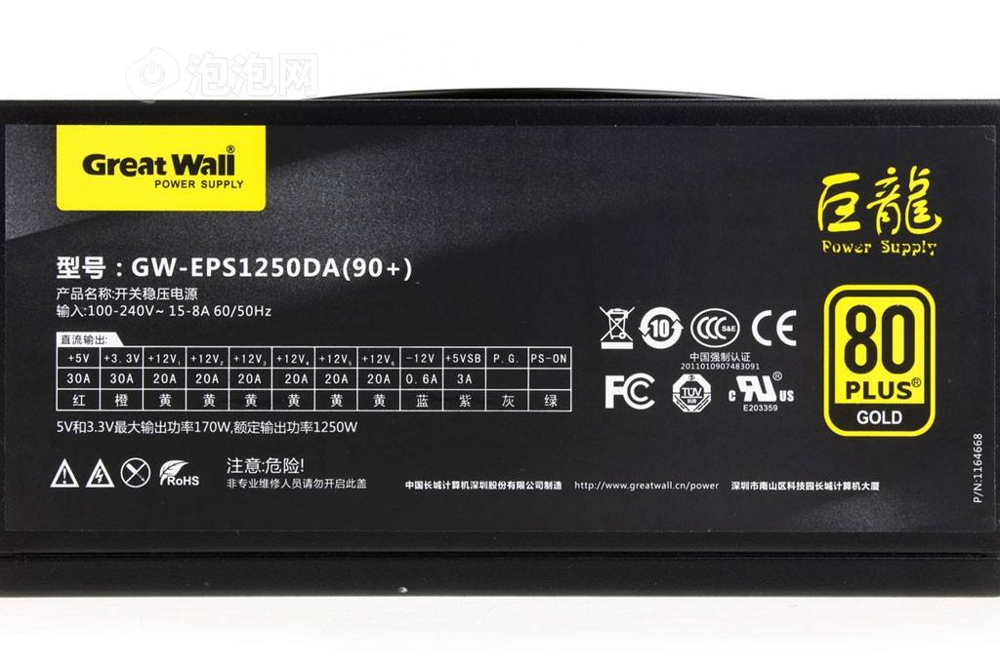
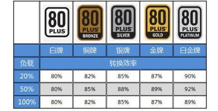

# 电源

小白攒机初期经常会发现 网上标着同样功率的电源价格千差万别，而买了便宜电源后似乎也没有出现什么问题。  
但实际上电源的作用除了将交流市电转化为直流输出外，还有稳压的作用，而垃圾电源，不仅不稳压，输出电压还可能频繁波动不稳定，日积月累下来，机械硬盘坏道、固态硬盘掉盘、内存故障蓝屏，等等问题随着时间 终究会显现出来。

我总结了一下几点购买电源需要关注的

## 电源铭牌

下面以 “矿龙” 的铭牌为例：

### 额定功率

电源的额定功率是最重要的参数，指的是电源可以长时间稳定输出的功率，电源在这一功率下可以保持持续稳定的输出。  
与之类似的还有一个最大功率，指的是电源在很短时间内可以输出的峰值功率。最大功率会在你开机的时候，以及偶尔发生的高负载运算时发挥作用，但是不能维持长久。  
有些小厂电源会把最大功率放在显眼的地方来误导消费者，这一点需要注意。

在买电源的时候，无脑上大电源当然很OK，大不了就为以后升级配置做准备，不过常规来说还是应该学会估算自己的配置，避免买小。

估算只需满足下面的条件即可

- 电源+12V输出功率 >= CPU功率 + 显卡功率 + 60W
- 电源额定功率 >= CPU功率 + 显卡功率 + 120W

CPU和显卡的功率 可以近似的取其 TDP热设计功耗

此外还要记得留一些余量，在开始阶段 以及一些短时间的高负载计算时期，整机功耗是会增加的。

### 80plus认证

代表能量转换效率，简单来说就是等级越高 损耗电量越小，越省电。

## 厂家参数

前面说了，电源除了变压功能，还需要起到稳压的作用，这是厂家为电源使用的稳压技术就非常关键。

这里本来想直接把 图吧大佬翼王的电源科普贴直接抄过来，结果发现重要楼层被百度吞了，所以这里先贴结论

无PFC / 假PFC < 被动PFC < 主动PFC
老式半桥 < 单管正激 < 双管正激 、LLC半桥/全桥 （效率成本动态响应等各方面互有胜负）
单路磁放大 < 双路磁放大 < DC-DC

## 参考连接 

- [【科普向】台式机电源到底应该怎么挑 V2.0 修订版](http://tieba.baidu.com/p/4484942979)   

