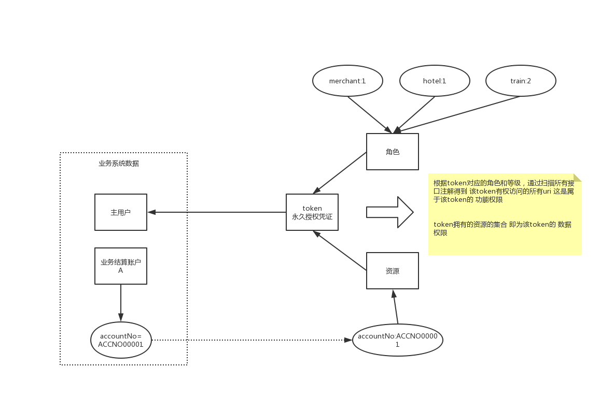
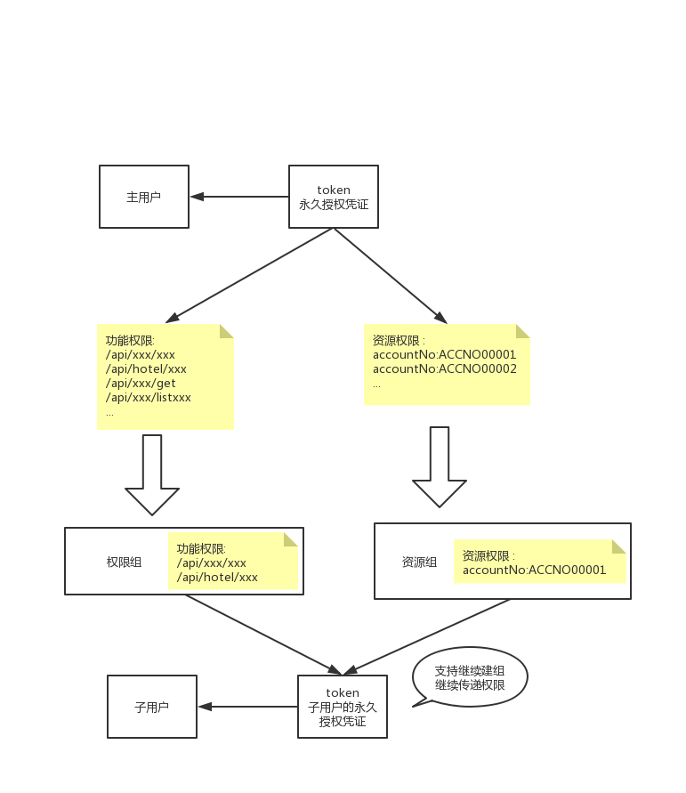

# 基本概念

- authbean 权限实体 与接口一一对应 参照管理后台的权限实体注解(类似)
    - funExpression 功能权限表达式 用于控制功能鉴权规则
    - resExpression 资源权限表达式 用于控制资源鉴权规则
- super-token 主token
    - role 角色 与主token相关联，一个主token可以拥有多个角色，每个角色都有其对应的等级。扫描所有权限实体 与 主token拥有的角色和等级 做计算 可以得到主token拥有的所有功能权限。
    - res-grant 资源授权 与主token相关联，在进行资源鉴权时，根据权限实体的资源权限表达式 与 token拥有的资源授权 做计算 可以判断当前token是否有权访问这个资源
- sub-token 子token，可以由主token创建 也可以由其他子token创建
    - fun-group 权限组 将token拥有的功能权限配置到权限组中，将子token加入权限组即可为其赋予该权限组中的功能权限
    - res-group 资源组 将token拥有的资源配置到资源组中，将子token加入到资源组即可为其服务该资源组中的资源权限
- v-token 虚拟授权凭证 由是token生成的具有过期时间的临时凭证，调用接口时需要带上此凭证

附图:

主账户的权限来源  

子账户的权限来源  

**长话短说:**

权限实体与具体的接口相对应，你可以在权限实体中配置功能权限和数据权限的鉴权规则

用户与token相对应，你需要自行将业务系统中的用户 与twiggy中的token进行绑定，主账户就是主token，子账户(如果业务上有)就是子token

主token的功能权限来自于 它的拥有角色和等级 一个主token可以有多个角色，数据权限来自于它拥有资源

子token的功能权限和数据权限分别来自与权限组 和 资源组。权限组和资源组可以由主token或者子token创建，可以在自己创建的组中放置自己拥有的权限
